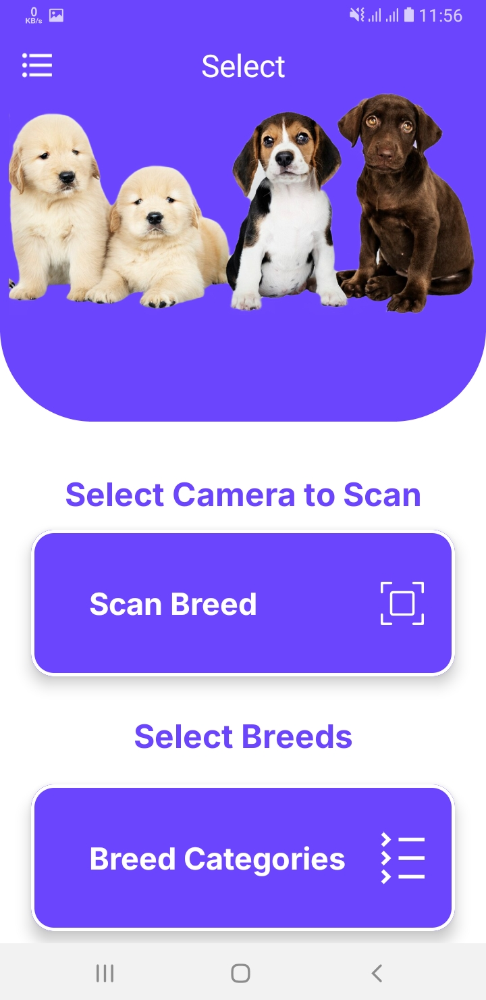
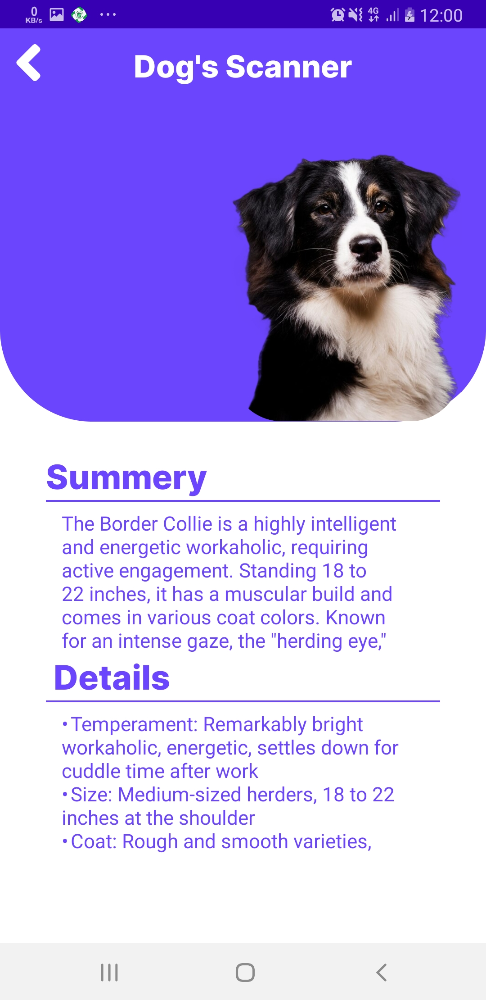

# 🐶🐱 Cat & Dog Breed Recognizer

An AI-powered Android application that identifies cat and dog breeds using image recognition.  
Built using Kotlin and Machine Learning technologies to deliver accurate and fast predictions.

---

## 🚀 Features

- 📷 Capture image using Camera
- 🖼 Select image from Gallery
- 🤖 AI-based breed classification
- ⚡ Fast and lightweight processing
- 📱 Clean and user-friendly UI

---

## 🧠 Tech Stack

- **Language:** Kotlin
- **Architecture:** MVVM
- **Machine Learning:** TensorFlow Lite
- **Image Processing:** ML Kit
- **UI:** XML + Material Design
- **IDE:** Android Studio

---

## 📸 Screenshots

| Home Screen | Result Screen |
|-------------|---------------|
|  |  |

---

## ⚙️ Installation

1. Clone the repository:

```bash
git clone https://github.com/iam-mudassirkhan/CatAndDogBreed_Recognizer.git
